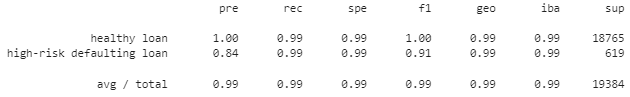

# Credit Risk Modelling

Classification predictive modelling is a supervised machine learning approach that can be used to identify the creditworthiness of borrowers. Binary classification where the classification has only two possible outcomes, for example either true or false, is the focus of this exercise. We examine two models for credit risk modelling:
* Model 1 - Logistic regression model with original data, and
* Model 2 - Logistic regression model with resampled training data.

To evaluate the performance of each model, we use metrics such as accuracy, precision and recall score.

## Data and Assumption
A dataset of historical lending activity from a peer-to-peer lending services company is used for the modelling. This dataset has 77,526 records and contains the following variables:
* size of the loan
* loan interest rate
* borrower's income
* borrower's debt to income ratio
* number of loan accounts
* an indicator of derogatory marks
* total debt amount
* loan status

Variables are assumed to be independent of each other.  

## Machine Learning
The below summarises the key steps followed in this machine learning exercise:
1. **Preparing data** - Separate the data into target and features. Target represents the outcome that we want the model to predict. Features are the variables used by the model to predict the target. In this exercise, "loan status" is the target and features are the remaining seven variables provided in the lending history. Loan status is marked with 0 or 1 where value of 0 means the loan is healthy and value of 1 means the loan has a high risk of defaulting.

2. **Preprocessing data** - The data is then split into training and testing sets. The training set is the set the model learns from. The testing set is used to check the accuracy of the model after training.

3. **Selecting model** - The objective of the model is to classify whether a loan is healthy or high-risk of defaulting. The output is categorical rather than numerical. We need a model that is suitable for categorical output. Given the required output, logistic regression model is selected. 

4. **Training the model** - We pass the training set data to the logistic regression model to find patterns and make predictions using the testing data. 

5. **Evaluating the model** - To evaluate the performance of the model, we focus on metrics such as accuracy score, precision rate and recall rate. 

Out of the total 77526 loans, 2500 (or 3%) is categorised as high risk of defaulting. The disproportionate ratio of healthy and high-risk defaulting loans can make training efficient machine learning models difficult. Data resampling and ensemble learning are the common techniques used to handle this class imbalance. In this exercise, we focus on data resampling technique, specifically the over sampling technique.

Over sampling involves adding samples of the high-risk defaulting loans to the training set. We use the RandomOverSampler module from the imbalanced-learn library to resample the data, fit a second logistic model with the resampled training data and make prediction using the testing data. 

## Results
**Model 1: Logistic regression model with original data**

 

Model 1 has a balanced accuracy score of 95%. The model is able to predict healthy loan with 100% precision and 99% recall. The prediction on high-risk loan is moderately precise (85%) and with reasonably high recall (91%). 

**Model 2: Logistic regression model with resampled training data**

Model 2 has a balanced accuracy score of 99%. Similar to Model 1, Model 2 is able to predict healthy loan with 100% precision and 99% recall. Model 2's prediction on high-risk loan is moderately precise (84% score) and has a slightly higher recall (99%) as compared to Model 1. 

## Recommendation

In the context of lending services, it is critical to minimise the exposure to high-risk defaulting loan. A model that minimising false healthy loan is preferred. Model 2 - Logistic regression model with resampled data is recommended given
* Model 2 has higher accuracy score 99% compared to Model 1 (95%), 
* Model 2 predicts healthy loan equally well as Model 1 (i.e. similar precision and recall), and 
* Model 2 predicts high-risk defaulting loan with similar precision as model 1 but higher recall than model 1. This means Model 2 is likely to minimise false healthy loan prediction better than Model 1. 
